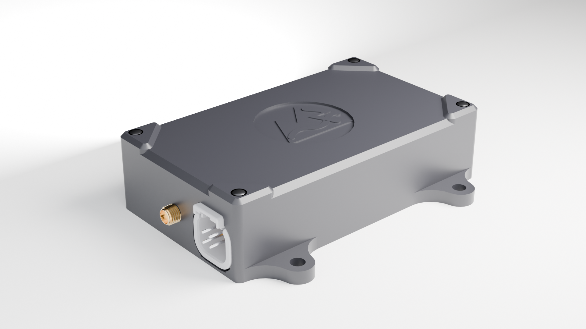

# TrailCurrent Bearing



GNSS (Global Navigation Satellite System) module for precise positioning, timing, and navigation. Part of the [TrailCurrent](https://trailcurrent.com) open-source vehicle platform.

## Project Overview

TrailCurrent Bearing is a standalone GNSS module that reads data from a DFRobot Gravity GNSS receiver via I2C and distributes it over the CAN bus for other modules to consume.

**Example Use Cases:**
- Digital clocks with precise time synchronization
- Navigation and geolocation devices
- Geospatial macros that control devices based on pinned locations
- Vehicle tracking and positioning systems

## Hardware Overview

- **Microcontroller:** ESP32-WROOM-32
- **GNSS Receiver:** DFRobot Gravity GNSS (I2C, multi-constellation)
- **CAN Bus:** 500 kbps via TWAI driver (GPIO 15 TX, GPIO 13 RX)
- **I2C:** GPIO 21 SDA, GPIO 22 SCL
- **Flash:** 4 MB with dual OTA partitions

### Components

- DFRobot Gravity GNSS module (GPS + BeiDou + GLONASS)
- ESP32 microcontroller
- CAN transceiver
- Buck converter for regulated power supply
- JST XH connectors for power and signal distribution

### KiCAD Library Dependencies

This project uses the consolidated [TrailCurrentKiCADLibraries](https://github.com/trailcurrentoss/TrailCurrentKiCADLibraries).

**Setup:**

```bash
# Clone the library
git clone git@github.com:trailcurrentoss/TrailCurrentKiCADLibraries.git

# Set environment variables (add to ~/.bashrc or ~/.zshrc)
export TRAILCURRENT_SYMBOL_DIR="/path/to/TrailCurrentKiCADLibraries/symbols"
export TRAILCURRENT_FOOTPRINT_DIR="/path/to/TrailCurrentKiCADLibraries/footprints"
export TRAILCURRENT_3DMODEL_DIR="/path/to/TrailCurrentKiCADLibraries/3d_models"
```

See [KICAD_ENVIRONMENT_SETUP.md](https://github.com/trailcurrentoss/TrailCurrentKiCADLibraries/blob/main/KICAD_ENVIRONMENT_SETUP.md) for detailed setup instructions.

## Firmware

Built with ESP-IDF (v5.5.x). Pure C, no Arduino framework.

### Prerequisites

```bash
# Install ESP-IDF (one-time setup)
# See https://docs.espressif.com/projects/esp-idf/en/stable/esp32/get-started/

# Source the ESP-IDF environment
source ~/esp/v5.5.2/esp-idf/export.sh
```

### Build and Flash

```bash
idf.py set-target esp32
idf.py build
idf.py -p /dev/ttyUSB0 flash monitor
```

### OTA Firmware Update

Firmware can be updated over-the-air via the CAN bus trigger protocol:

1. Send CAN ID `0x00` with the target device's last 3 MAC bytes
2. The device joins WiFi (credentials must be provisioned first) and starts an HTTP server
3. Upload the new firmware binary:

```bash
curl -X POST http://esp32-XXYYZZ.local/ota --data-binary @build/bearing.bin
```

The device writes to the inactive OTA partition and reboots with the new firmware. If the upload fails or times out (3 minutes), the device returns to normal operation.

### mDNS Self-Discovery

When CAN ID `0x02` is broadcast (typically by the Headwaters controller), all modules with WiFi credentials join the network and advertise themselves via mDNS:

- **Service:** `_trailcurrent._tcp`
- **TXT Records:**
  - `type=bearing` — module type
  - `canid=0x06` — primary CAN status message ID
  - `fw=<version>` — firmware version

The Headwaters controller queries mDNS to discover all online modules, then confirms each via `GET /discovery/confirm`. Modules disconnect from WiFi and return to CAN-only operation after confirmation or a 3-minute timeout.

## CAN Bus Protocol

All messages use standard (11-bit) identifiers at 500 kbps.

### Graceful Node Management

The CAN bus uses a TX_ACTIVE / TX_PROBING state machine that allows nodes to enter and leave the bus without impacting other nodes:

- **TX_ACTIVE:** Normal operation at 30 Hz. If 3 consecutive TX failures occur (no ACK from peers), transitions to TX_PROBING.
- **TX_PROBING:** Sends a single status message every 2 seconds. When a peer ACKs a transmission or incoming RX data is detected, transitions back to TX_ACTIVE.

This means unplugging a module causes it to gracefully back off, and plugging it back in resumes full-rate communication automatically with zero configuration.

### TX Messages (GNSS Data)

| ID | Name | DLC | Format |
|----|------|-----|--------|
| `0x06` | DateTime | 7 | `[year_H, year_L, month, day, hour, minute, second]` |
| `0x07` | SatSpeedCourse | 6 | `[satellites, speed_H, speed_L, course_H, course_L, gnss_mode]` |
| `0x08` | Altitude | 4 | `[alt_3, alt_2, alt_1, alt_0]` — altitude in meters * 100 |
| `0x09` | LatLon | 8 | `[lat_sign, lat_2, lat_1, lat_0, lon_sign, lon_2, lon_1, lon_0]` — degrees * 10000 |

**Encoding details:**
- **Speed:** knots * 100 (uint16, big-endian)
- **Course:** degrees * 10 (uint16, big-endian, rounded)
- **Altitude:** meters * 100 (uint32, big-endian)
- **Lat/Lon:** sign byte (0=positive, 1=negative) + 24-bit scaled value (degrees * 10000)

### RX Messages (Control)

| ID | Name | Purpose |
|----|------|---------|
| `0x00` | OTA Trigger | `[mac0, mac1, mac2]` — target device by last 3 MAC bytes |
| `0x01` | WiFi Config | Chunked credential provisioning (see below) |
| `0x02` | Discovery | Broadcast trigger for mDNS self-discovery |
| `0x04` | Version Report | Sent on boot: `[mac3, mac4, mac5, major, minor, patch]` — reports running firmware version to Headwaters |

### WiFi Credential Provisioning (CAN ID 0x01)

WiFi credentials are sent in 6-byte chunks over CAN:

1. **Start:** `[0x01, ssid_len, pass_len, ssid_chunks, pass_chunks]`
2. **SSID chunks:** `[0x02, chunk_index, byte0..byte5]`
3. **Password chunks:** `[0x03, chunk_index, byte0..byte5]`
4. **End:** `[0x04, xor_checksum]`

Each chunk carries up to 6 bytes. A 5-second timeout resets reception if a chunk is missed.

## GNSS Modes

The DFRobot Gravity receiver supports multiple satellite constellation configurations:

| Mode | Constellations |
|------|---------------|
| 1 | GPS only |
| 2 | BeiDou only |
| 3 | GPS + BeiDou |
| 4 | GLONASS only |
| 5 | GPS + GLONASS |
| 6 | BeiDou + GLONASS |
| 7 | GPS + BeiDou + GLONASS (default) |

## Project Structure

```
main/                       # ESP-IDF firmware
├── main.c                  # GNSS polling, CAN TX/RX with state machine
├── gnss.h / gnss.c         # DFRobot GNSS I2C driver
├── ota.h / ota.c           # OTA updates & WiFi provisioning
├── discovery.h / discovery.c  # mDNS auto-discovery
├── CMakeLists.txt          # Build config
└── idf_component.yml       # Managed dependencies (mdns)

EDA/                        # KiCAD hardware design
├── trailcurrent-gps-module.kicad_pro
├── trailcurrent-gps-module.kicad_sch  # Root schematic (5 sheets)
├── trailcurrent-gps-module.kicad_pcb
├── mcu.kicad_sch           # MCU subsystem
├── power.kicad_sch         # Power management
├── can.kicad_sch           # CAN interface
└── connectivity.kicad_sch  # GNSS interface

CAD/                        # FreeCAD housing / 3D prints
partitions.csv              # Dual OTA partition table
sdkconfig.defaults          # Build defaults
```

## Manufacturing

- **PCB Files:** Ready for fabrication via standard PCB services (JLCPCB, OSH Park, etc.)
- **BOM Generation:** Export BOM from KiCAD schematic (Tools > Generate BOM)
- **JLCPCB Assembly:** See [BOM_ASSEMBLY_WORKFLOW.md](https://github.com/trailcurrentoss/TrailCurrentKiCADLibraries/blob/main/BOM_ASSEMBLY_WORKFLOW.md)

## License

MIT License - See LICENSE file for details

This is open source hardware. You are free to use, modify, and distribute these designs for personal or commercial purposes.

## Contributing

Improvements and contributions are welcome! Please submit issues or pull requests to the main repository.

## Support

For questions about:
- **KiCAD setup:** See [KICAD_ENVIRONMENT_SETUP.md](https://github.com/trailcurrentoss/TrailCurrentKiCADLibraries/blob/main/KICAD_ENVIRONMENT_SETUP.md)
- **Library consolidation:** See [CONNECTOR_CONSOLIDATION_SUMMARY.md](https://github.com/trailcurrentoss/TrailCurrentKiCADLibraries/blob/main/CONNECTOR_CONSOLIDATION_SUMMARY.md)
- **Assembly workflow:** See [BOM_ASSEMBLY_WORKFLOW.md](https://github.com/trailcurrentoss/TrailCurrentKiCADLibraries/blob/main/BOM_ASSEMBLY_WORKFLOW.md)
